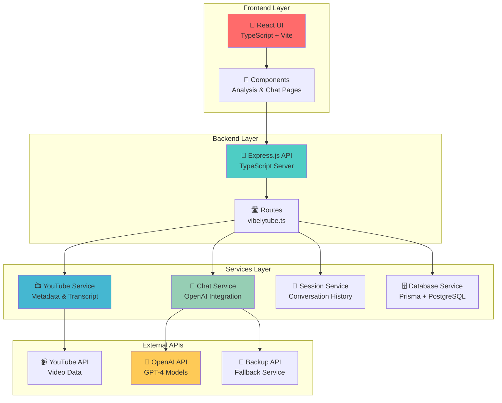
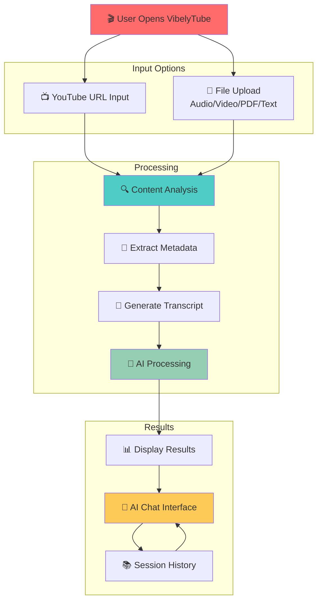
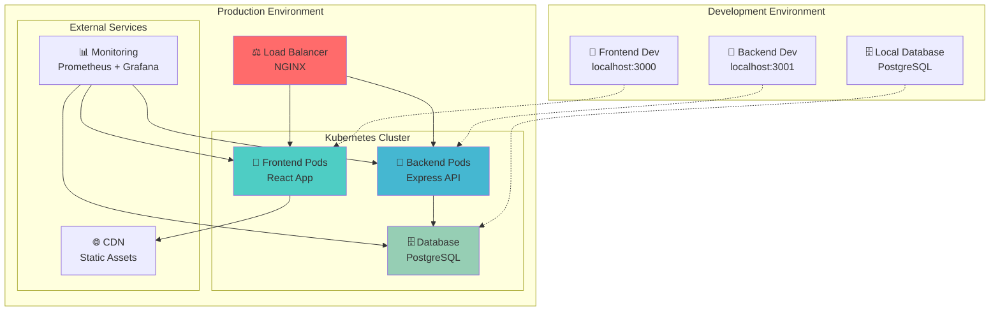

# 🎬 VibelyTube Essential - Visual Pipeline Presentation

## 🎯 Project Overview

**VibelyTube Essential** adalah platform analisis YouTube dengan AI yang dibangun dengan prinsip *"Intinya aja dongs!"* - fokus pada fitur core yang paling penting untuk user experience.

## 🏗️ System Architecture Visual

## 🔄 CI/CD Pipeline Flow

```mermaid
graph LR
    subgraph "Development"
        DEV[👨‍💻 Developer<br/>Push Code]
        BRANCH[🌿 Git Branch<br/>main/develop]
    end
    
    subgraph "CI Stage"
        TRIGGER[⚡ GitHub Actions<br/>Triggered]
        BUILD[🏗️ Build Process]
        TEST[🧪 Testing Suite]
        SCAN[🔒 Security Scan]
    end
    
    subgraph "CD Stage"
        DOCKER[🐳 Docker Build]
        REGISTRY[📦 Container Registry]
        DEPLOY[🚀 Deploy K8s]
        VERIFY[✅ Health Check]
    end
    
    subgraph "Monitoring"
        SLACK[📢 Slack Notify]
        LOGS[📊 Monitoring]
    end
    
    DEV --> BRANCH
    BRANCH --> TRIGGER
    TRIGGER --> BUILD
    BUILD --> TEST
    TEST --> SCAN
    SCAN --> DOCKER
    DOCKER --> REGISTRY
    REGISTRY --> DEPLOY
    DEPLOY --> VERIFY
    VERIFY --> SLACK
    VERIFY --> LOGS
    
    style DEV fill:#ff6b6b
    style BUILD fill:#4ecdc4
    style TEST fill:#45b7d1
    style DEPLOY fill:#96ceb4
    style VERIFY fill:#feca57
```

## 🌊 User Journey Flow

## 🎯 Key Features Timeline

```mermaid
gantt
    title VibelyTube Essential Development Timeline
    dateFormat  X
    axisFormat %s
    
    section Core Features
    YouTube Analysis    :active, youtube, 0, 3
    File Upload        :active, upload, 1, 4
    AI Chat Integration :active, chat, 2, 5
    Session Management  :active, session, 3, 6
    
    section UI/UX
    React Components   :react, 1, 4
    Responsive Design  :design, 2, 5
    Modern Interface   :interface, 3, 6
    
    section DevOps
    CI/CD Pipeline     :pipeline, 4, 7
    Docker Setup       :docker, 5, 8
    Kubernetes Deploy  :k8s, 6, 9
    Monitoring         :monitor, 7, 10
```

## 🚀 Deployment Architecture

## 📊 Technology Stack Visual

```mermaid
graph LR
    subgraph "Frontend Stack"
        REACT[⚛️ React 18]
        TS_FE[📘 TypeScript]
        VITE[⚡ Vite]
        CSS[🎨 CSS3]
    end
    
    subgraph "Backend Stack"
        NODE[💚 Node.js]
        EXPRESS[🚀 Express.js]
        TS_BE[📘 TypeScript]
        PRISMA[🔷 Prisma ORM]
    end
    
    subgraph "Database & Storage"
        POSTGRES[🐘 PostgreSQL]
        FILES[📁 File Storage]
    end
    
    subgraph "External APIs"
        OPENAI_API[🧠 OpenAI API]
        YT_API[📹 YouTube API]
    end
    
    subgraph "DevOps Tools"
        DOCKER[🐳 Docker]
        K8S[☸️ Kubernetes]
        GITHUB[🐙 GitHub Actions]
        NGINX[🌐 NGINX]
    end
    
    REACT --> TS_FE
    TS_FE --> VITE
    VITE --> CSS
    
    NODE --> EXPRESS
    EXPRESS --> TS_BE
    TS_BE --> PRISMA
    
    PRISMA --> POSTGRES
    EXPRESS --> FILES
    
    EXPRESS --> OPENAI_API
    EXPRESS --> YT_API
    
    DOCKER --> K8S
    GITHUB --> DOCKER
    K8S --> NGINX
    
    style REACT fill:#61dafb
    style EXPRESS fill:#000000
    style POSTGRES fill:#336791
    style OPENAI_API fill:#412991
    style DOCKER fill:#2496ed
```

## 🎬 Live Demo Flow

### Demo Script untuk Presentasi:

1. **🎯 Opening** (30 detik)
   - "VibelyTube Essential - Intinya aja dongs!"
   - Tunjukkan homepage yang clean dan modern

2. **📺 YouTube Analysis Demo** (2 menit)
   - Input YouTube URL
   - Tunjukkan proses loading dengan visual indicator
   - Tampilkan hasil: metadata, transcript, summary

3. **📁 File Upload Demo** (1.5 menit)
   - Upload video/audio file
   - Tunjukkan processing progress
   - Hasil ekstraksi konten

4. **🤖 AI Chat Demo** (2 menit)
   - Chat dengan AI tentang konten yang sudah dianalisis
   - Tunjukkan contextual responses
   - Session history

5. **🔧 Technical Highlights** (1.5 menit)
   - Architecture diagram
   - CI/CD pipeline
   - Deployment strategy

6. **🚀 Q&A** (2 menit)
   - Terima pertanyaan
   - Demo fitur tambahan jika ada

---

## 🎨 Visual Assets untuk Presentasi

### Color Scheme:
- **Primary**: `#4ecdc4` (Teal)
- **Secondary**: `#ff6b6b` (Coral)
- **Accent**: `#feca57` (Yellow)
- **Success**: `#96ceb4` (Mint)
- **Info**: `#45b7d1` (Blue)

### Icons Used:
- 🎬 Project
- 📺 YouTube
- 🤖 AI
- 📁 Files
- 🚀 Deployment
- 🔧 Technical
- 📊 Analytics
- 💬 Chat

### Slide Templates:
1. Title slide dengan logo dan tagline
2. Architecture diagrams
3. Feature demos dengan screenshots
4. Pipeline visualization
5. Technical stack overview
6. Q&A slide